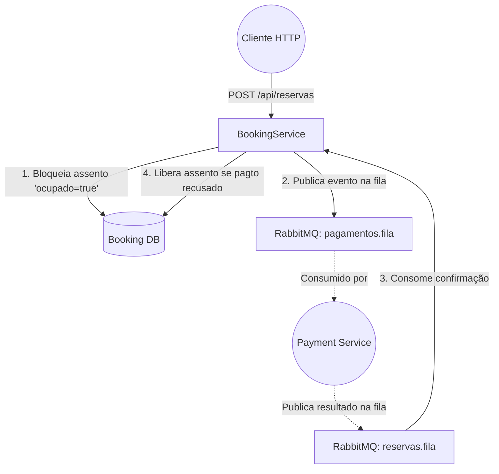

# Booking Service 🎬🍿


> **ℹ️ Nota do Desenvolvedor:** Este projeto foi desenvolvido com fins educacionais. O objetivo é demonstrar a aplicação de padrões de arquitetura de microserviços, boas práticas de engenharia de software e resolução de problemas complexos em sistemas distribuídos (como concorrência e resiliência).

Parte do ecossistema **Cinema Microservices**, o `booking-service` é o microserviço responsável por gerenciar o mapa de assentos, receber as intenções de reserva dos clientes e iniciar o fluxo assíncrono de compra. Veja também o serviço parceiro: [`payment-service`](https://github.com/ArturRossiJunior/payment-service).

---

## 🏆 Principais Tecnologias & Aprendizados

> Este projeto foi construído com foco no aprofundamento prático nas três tecnologias abaixo, que representam pilares fundamentais do desenvolvimento backend moderno.

| Tecnologia | Papel no Projeto | Conceitos Aplicados |
|---|---|---|
| 🐳 **Docker & Docker Compose** | Orquestra toda a infraestrutura local (PostgreSQL + RabbitMQ) em containers isolados e reproduzíveis. | Volumes persistentes, variáveis de ambiente via `.env`, redes internas entre containers, `healthcheck`. |
| 🐇 **RabbitMQ** | Backbone da comunicação assíncrona entre `booking-service` e `payment-service`. | Exchanges, filas (Queues), consumers, Dead-Letter Queue, desacoplamento produtor/consumidor. |
| 🧩 **Microserviços** | Arquitetura distribuída com responsabilidades bem delimitadas por serviço. | Database-per-Service, Event-Driven Architecture, contratos de mensageria via DTOs, resiliência transacional. |
| 🧪 **Testes Automatizados** | Garantia de qualidade do software e funcionamento isolado. | Testes Unitários (Mockito), Testes de Slice Web (MockMvc), Banco em memória (H2), Cobertura de regras de negócio. |
| 🤖 **CI/CD (GitHub Actions)** | Automação da esteira de integração contínua. | Actions trigam a cada *push*, rodando os testes e buildando a imagem Docker automaticamente. |
| ☁️ **Deploy em Nuvem (Railway)** | Hospedagem em produção do microserviço. | Provisionamento de Postgres e RabbitMQ em nuvem, variáveis de ambiente seguras, *Continuous Deployment* (CD) integrado ao GitHub, Imagem Otimizada com Docker Multi-stage Build. |

---

## 🏗️ Arquitetura e Papel no Sistema

Este serviço atua como o ponto de entrada principal para as compras. Ele **não** processa pagamentos, ele delega essa responsabilidade ao `payment-service` de forma assíncrona via **RabbitMQ**, retornando a resposta ao cliente imediatamente sem bloquear a thread.



## 🚀 Tecnologias Utilizadas

| Tecnologia | Versão | Uso |
|---|---|---|
| Java | 17 | Linguagem principal |
| Spring Boot | 4.0.6 | Web, Data JPA, Validation, AMQP |
| PostgreSQL | 16 | Banco de dados isolado (`booking_db`) |
| Flyway |   | Migrations e seed de assentos |
| RabbitMQ | 3 | Mensageria assíncrona |
| Docker & Compose |   | Orquestração da infraestrutura local |

## ☁️ CI/CD & Deploy na Nuvem (Railway)

Este microserviço está configurado com uma esteira completa de **Integração e Entrega Contínuas (CI/CD)**:

1. **Testes e Build:** Ao realizar um `push` na branch `main`, o **GitHub Actions** (`ci.yml`) assume o controle. Ele roda toda a suíte de testes automatizados e constrói a imagem da aplicação.
2. **Otimização (Docker Multi-stage):** O `Dockerfile` do projeto foi desenhado com o padrão *Multi-stage Build*, que separa o ambiente pesado de compilação (Maven+JDK) do ambiente levíssimo de execução (JRE), resultando em uma imagem minúscula, segura e rápida.
3. **Deploy (Railway):** O Railway monitora o repositório e, após o sucesso da pipeline, realiza o pull do código, monta a imagem Docker e sobe o servidor. O banco de dados PostgreSQL e o RabbitMQ também estão hospedados na mesma infraestrutura de nuvem, conectados via variáveis de ambiente.

### 🌐 Teste a API em Produção

A API está no ar e pronta para receber requisições de teste. Sinta-se à vontade para disparar uma reserva!

**URL Base:** `https://booking-service-production-412d.up.railway.app`

**Exemplo de Requisição (POST `/api/reservas`):**
```bash
curl -X POST https://booking-service-production-412d.up.railway.app/api/reservas \
-H "Content-Type: application/json" \
-d '{"assentoId": 15, "usuarioId": 99, "metodo": "PIX"}'
```
> Tente enviar com o método "CARTAO" e um valor que ultrapasse o limite de R$ 30,00 para ver o `payment-service` recusando a transação em background e liberando o assento segundos depois!

## ⚙️ Como Executar Localmente

### 1. Pré-requisitos

- **Docker** e **Docker Compose** instalados.
- **Java 17** (JDK).

### 2. Configurando o Ambiente

Crie um arquivo `.env` na raiz do projeto, usando o `.env.example` como base:

```properties
DB_HOST=localhost
DB_PORT=5432
DB_NAME=booking_db
DB_USERNAME=postgres
DB_PASSWORD=sua_senha_aqui
```

### 3. Subindo a Infraestrutura

Na raiz deste projeto (onde está o `docker-compose.yml`), suba o **RabbitMQ** e os **dois bancos PostgreSQL isolados**:

```bash
docker-compose up -d
```

> **💡 Painel do RabbitMQ:** A imagem `rabbitmq:3-management-alpine` já inclui a interface administrativa. Acesse `http://localhost:15672` (usuário: `guest` / senha: `guest`) para monitorar as filas em tempo real.

### 4. Iniciando a Aplicação

```bash
./mvnw spring-boot:run
```

> **💡 IntelliJ IDEA:** Para usar o botão de "Run" da IDE, instale o plugin **EnvFile**. Nas configurações de execução (Run/Debug Configurations), acesse a aba "EnvFile", marque "Enable EnvFile" e adicione o arquivo `.env` do projeto.

---

## 📡 API Endpoints

### `POST /api/reservas` — Criar uma Reserva

**Request Body:**

```json
{
  "assentoId": 11,
  "usuarioId": 1,
  "metodo": "PIX"
}
```

**✅ Response `201 Created` — Reserva criada com sucesso:**

```json
{
  "id": 11,
  "codigoPosicao": "B1",
  "tipo": "NORMAL",
  "valor": 15.00,
  "ocupado": true
}
```

**❌ Response `409 Conflict` — Assento já reservado (concorrência):**

```json
{
  "status": 409,
  "erro": "Conflito de Concorrência",
  "mensagem": "O assento foi reservado por outro usuário simultaneamente. Tente novamente."
}
```

**❌ Response `400 Bad Request` — Dados de entrada inválidos:**

```json
{
  "status": 400,
  "erro": "Requisição Inválida",
  "mensagem": "O campo 'assentoId' não pode ser nulo."
}
```

> **Nota:** A resposta `201` confirma que a **reserva foi criada e o pagamento foi enviado para processamento**. A aprovação final do pagamento ocorre de forma assíncrona pelo `payment-service`.

---

## 🛠️ Boas Práticas Aplicadas

- **Controle de Concorrência — Optimistic Locking**
  A anotação `@Version` do JPA garante que duas requisições simultâneas para o mesmo assento resultem em `409 Conflict` (via `ObjectOptimisticLockingFailureException`), impedindo a venda duplicada de um ingresso.

- **Resiliência Transacional**
  Se o RabbitMQ estiver indisponível no momento do envio da mensagem, a transação local faz *rollback* automático da reserva no banco, evitando que um assento fique bloqueado sem o correspondente processamento de pagamento.

- **Tratamento Global de Exceções — `@RestControllerAdvice` e Exceptions Específicas**
  Respostas de erro padronizadas em JSON em todo o sistema, eliminando o vazamento de *stack traces* do Spring para o cliente. A criação de exceções para propósitos específicos (como `RegraNegocioException`) permite que regras como "Assento Inexistente" disparem um erro legível sem poluir o código. Códigos HTTP semânticos: `400` para validação e negócio, `409` para concorrência.

- **Padrão DTO com Java Records**
  O esquema interno do banco de dados (entidades JPA) nunca é exposto diretamente na API ou na fila de mensagens, prevenindo vulnerabilidades de *Over-Posting* e desacoplando a camada de persistência dos contratos externos.

- **Migrations com Flyway**
  Scripts DDL versionados garantem que qualquer ambiente seja provisionado de forma idêntica e controlada, sem depender das atualizações automáticas e imprevisíveis do Hibernate (`ddl-auto: update`).

- **Fail-Fast com Jakarta Validation**
  Anotações `@NotNull` e `@Valid` nos DTOs barram requisições malformadas na camada de entrada, antes de chegarem à lógica de negócio.

- **Segurança de Credenciais**
  Arquivos `.env` injetam secrets de banco e fila em runtime, protegidos via `.gitignore` para nunca serem commitados ao repositório.
